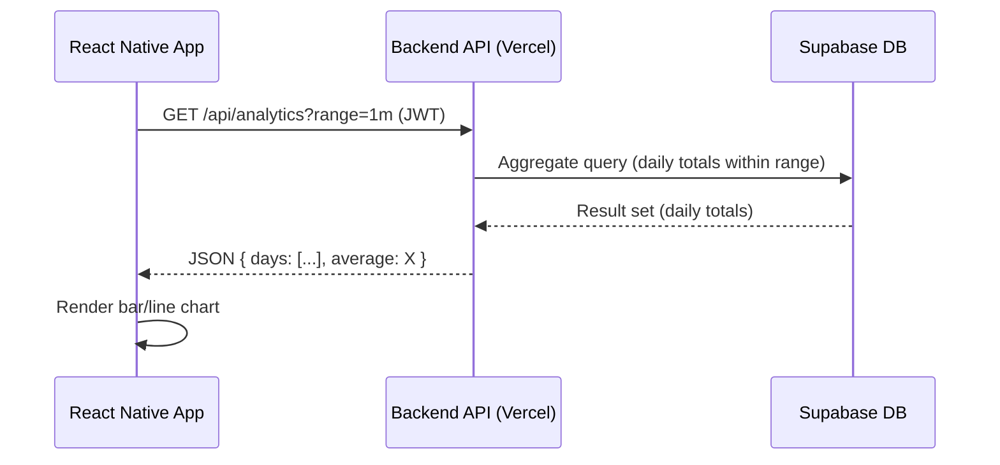

# Technical Architecture Document: Meditation Tracker V1 (MVP)

## 1. Overview

*   **System:** A simple iOS application allowing users to time and log meditation sessions using Google authentication.
*   **Goal (MVP):** Establish core functionality for session timing, Google login, and data recording (start time, duration, end time) in a backend database.
*   **Architecture:** Client-Server model.
    *   **Client:** React Native application (targeting iOS).
    *   **Server:** Backend API (`Node.js`/`TypeScript` on `Vercel`).
    *   **Database:** `Supabase` (Managed `PostgreSQL`).
*   **Justification:** This pattern clearly separates the user interface (iOS) from the business logic and data storage (Backend API + `Supabase`), facilitating independent development and scaling. `Vercel` and `Supabase` offer serverless/managed infrastructure suitable for an MVP with potential for growth.

## 2. Components

*   **React Native Frontend App (iOS):**
    *   Handles user interface display (timer, buttons) using React Native components.
    *   Manages Google Sign-In flow using a React Native Google Sign-In library.
    *   Interacts with the Backend API for authentication and saving session data.
    *   Manages local timer state (start, pause, resume, stop).
    *   Securely stores the API session token (e.g., using AsyncStorage or a secure storage solution for React Native).
    *   **Weekly Summary Panel & Analytics Screens (NEW):**
        * Displays a 7-day bar graph and average on the Timer screen.
        * Navigates to a dedicated Analytics screen with interactive charts for multiple date ranges.
        * Fetches aggregated data from the new analytics API endpoints.
*   **Backend API (`Node.js`/`TypeScript` on `Vercel`):**
    *   Provides RESTful endpoints for the iOS app.
    *   Handles Google ID token verification (potentially via `Supabase` Auth helpers).
    *   Manages user creation/lookup based on Google authentication.
    *   Issues and validates API session tokens (e.g., JWT).
    *   Receives session data from the iOS app.
    *   Interacts with the `Supabase` database to store user and session data.
    *   **Analytics & Reporting Logic (NEW):** Provides aggregated meditation statistics per user (daily totals, averages) for predefined ranges. Exposes new analytics API endpoints.
*   **`Supabase` Database (`PostgreSQL`):**
    *   Persistently stores user account information (leveraging `Supabase` Auth).
    *   Persistently stores meditation session records (`MeditationSessions` table).
    *   Enforces data security through Row Level Security (RLS).

## 3. Data Flows

### 3.1 User Authentication (Google Sign-In)


### 3.2 Recording a Meditation Session


### 3.3 Fetching Analytics Data (NEW)



## 4. API Specification

*(Note: Base URL assumed to be the `Vercel` deployment URL)*

*   **Authentication Endpoint:**
    *   **`POST /api/auth/google`**
        *   **Description:** Verifies Google Sign-In token/code, finds or creates a user, and returns an API session token.
        *   **Request Body:** `{ "googleToken": "string" }` or `{ "googleAuthCode": "string" }` (Exact format depends on implementation)
        *   **Response (200 OK):** `{ "apiToken": "string" }` (e.g., JWT)
        *   **Response (401 Unauthorized):** `{ "error": "Invalid Google token/code" }`
        *   **Response (500 Internal Server Error):** `{ "error": "Authentication processing failed" }`
*   **Session Endpoint:**
    *   **`POST /api/sessions`**
        *   **Description:** Saves a completed meditation session for the authenticated user. Requires a valid `apiToken` (e.g., in `Authorization: Bearer <token>` header).
        *   **Request Body:** `{ "session_start_time": "ISO8601_string", "duration_seconds": integer }`
        *   **Response (201 Created):** `{ "sessionId": "string/uuid", "message": "Session saved successfully" }`
        *   **Response (400 Bad Request):** `{ "error": "Invalid session data format" }`
        *   **Response (401 Unauthorized):** `{ "error": "Invalid or missing API token" }`
        *   **Response (500 Internal Server Error):** `{ "error": "Failed to save session" }`
*   **Analytics Endpoint (NEW):**
    *   **`GET /api/analytics`**
        *   **Description:** Returns aggregated meditation statistics for the authenticated user.
        *   **Query Parameters:**
            *   `range` (string, required): Accepted values — `7d`, `1m`, `3m`, `6m`, `1y`, `3y`, `5y`.
        *   **Headers:** `Authorization: Bearer <apiToken>`
        *   **Response (200 OK):**
            ```json
            {
              "range": "7d",
              "startDate": "2025-05-01",
              "endDate": "2025-05-07",
              "dailyTotals": [30, 0, 25, 40, 0, 20, 35],
              "averageMinutes": 21.4
            }
            ```
        *   **Response (400 Bad Request):** `{ "error": "Unsupported range value" }`
        *   **Response (401 Unauthorized):** `{ "error": "Invalid or missing API token" }`
        *   **Response (500 Internal Server Error):** `{ "error": "Failed to aggregate data" }`

## 5. Database Schema (`Supabase`/`PostgreSQL`)

*   **`auth.users` (Managed by `Supabase` Auth)**
    *   `id` (UUID, Primary Key) - Represents the user ID.
    *   `email` (String)
    *   Other `Supabase` Auth managed fields (`created_at`, etc.)
    *   Google ID is typically stored within `Supabase` Auth's identity linking or metadata.
*   **`public.MeditationSessions` Table:**
    *   `session_id` (UUID, Primary Key, default `gen_random_uuid()`)
    *   `user_id` (UUID, Foreign Key references `auth.users(id)`, ON DELETE CASCADE) - Links to the user who performed the session.
    *   `session_start_time` (TIMESTAMPTZ, NOT NULL) - When the session was started.
    *   `duration_seconds` (INTEGER, NOT NULL) - Duration of active meditation in seconds.
    *   `session_end_time` (TIMESTAMPTZ, NOT NULL, default `now()`) - When the session was stopped/saved. The backend can generate this upon receiving the request based on `session_start_time` and `duration_seconds`, or use `now()`.
    *   `created_at` (TIMESTAMPTZ, default `now()`) - Record creation timestamp.
*   **Row Level Security (RLS):**
    *   Enable RLS on `public.MeditationSessions`.
    *   Create policies ensuring users can only `SELECT`, `INSERT`, `UPDATE`, `DELETE` their *own* sessions (e.g., `USING (auth.uid() = user_id)`).

## 6. Component Interactions

*   **React Native App <-> Backend API:**
    *   Communication Protocol: HTTPS.
    *   Data Format: JSON.
    *   HTTP Client: `axios` is the preferred library for making HTTP requests.
    *   Authentication: The React Native App sends the Google Token/Code to the backend's `/api/auth/google` endpoint. The backend responds with an API Session Token (JWT). Subsequent requests from the React Native app to protected endpoints (like `POST /api/sessions` and `GET /api/analytics`) must include this token in the `Authorization: Bearer <token>` header.
*   **Backend API <-> `Supabase`:**
    *   Communication: The `Node.js` backend uses a `PostgreSQL` client library (e.g., `pg` or `Supabase`'s JS library) to connect securely to the `Supabase` database instance.
    *   Authentication: Connection uses database credentials securely managed by the `Vercel` environment variables.
    *   Operations: The backend executes SQL queries (or uses `Supabase` client methods) to interact with the `auth.users` and `public.MeditationSessions` tables, respecting RLS policies enforced by `Supabase`.
*   **React Native App <-> Google:**
    *   Communication: Uses a React Native Google Sign-In library, following Google's OAuth 2.0 protocol securely over HTTPS.